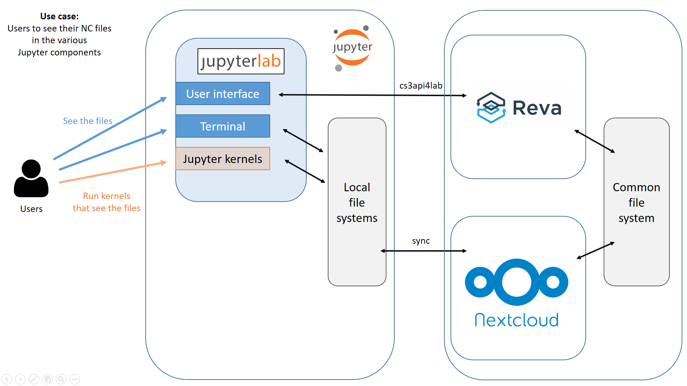

# Example for Z2JH running cs3api4lab and sync

The sync and login-flow-v2 approaches implemented within 
[Zero To JupyterHub](https://zero-to-jup=yterhub.readthedocs.io/) (Z2JH)
in Kubernetes
together with [cs3api4lab plugin](https://github.com/sciencemesh/cs3api4lab).



Tested with [Z2JH charts](https://github.com/jupyterhub/helm-chart) 
v. 0.9.0.

## Setup

Prerequisites:

- reva 1.3.0+
- Nextcloud
- Putting reva and Nextcloud onto the same local file storage, 
if you want to access the same files in the JupyterLab user interface
as well as in Terminal and from Jupyter kernels. 
This is a temporarily workaround before reva is integrated with Nextcloud.

This example extends [z2jh-sync](../z2jh-sync).
Start there and extend `config.yaml` with a `singleuser:` section
as in the example below.

Especially, choose the propor image/tag, reva host, and client id/secret.

```
# (...)

singleuser:
  image:
    name: michzimny/cs3api4lab-jupyterlab
    tag: branch-hotfix-master
    pullPolicy: Always
  defaultUrl: "/lab"
  extraEnv:
    CS3_EXT_CONFIG: "true"
    CS3_REVA_HOST: "172.19.0.1:19000"
    CS3_AUTH_TOKEN_VALIDITY: "3600"
    CS3_HOME_DIR: "/home"
    CS3_ENDPOINT: /
    CS3_CHUNK_SIZE: "4194304"
    CS3_SECURE_CHANNEL: "false"
    CS3_CLIENT_CERT: ""
    CS3_CLIENT_KEY: ""
    CS3_CA_CERT: ""
    CS3_CLIENT_ID: "einstein"
    CS3_CLIENT_SECRET: "relativity"
    CS3_LOGIN_TYPE: "basic"
```
